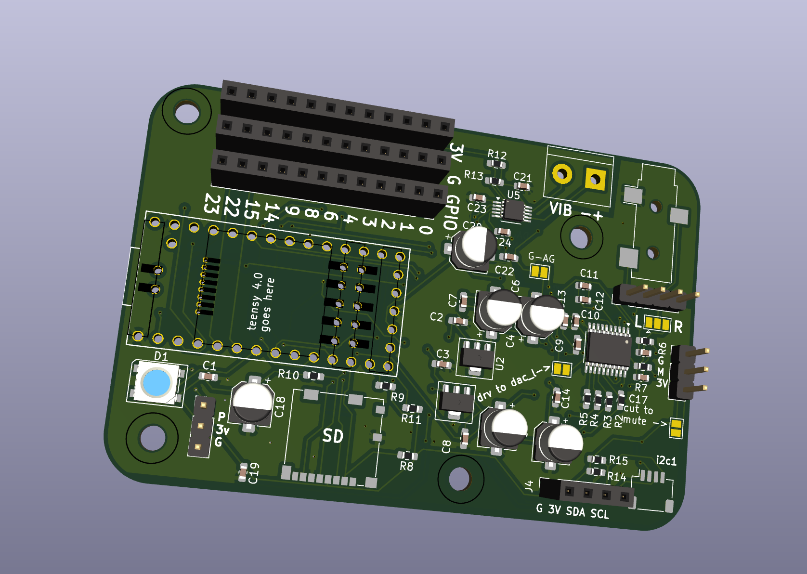

# Teensy-Haptic-Audio-Player

 

A PCB designed for audio and haptic projects with [a Teensy 4.0](https://www.pjrc.com/store/teensy40.html). 

Among other things, it can be used to play audio from the computer as a sound card when connected via USB or from audio files via the on board SD card reader. The audio will then be output both to a 3.5mm audio jack and a haptic driver that will make a vibration motor [like this one](https://www.adafruit.com/product/1201) vibrate in sync with the audio, kinda like in a gamepad, sex toy or phone.

Another usecase is simply as a high quality audio development platform.

The whole thing is open source and hackable and is designed to be used for many different scenarios.

See [hyaline.systems](https://hyaline.systems) for more information. Send an email if you want to buy a board. 

## Features

- Designed for the very powerful Teensy 4.0 board.
- High quality i2s stereo output DAC with 3.5mm line out jack: [PCM5102A DAC](https://www.ti.com/product/PCM5102A) – this DAC is widely compatible with all platforms and SDK's, including Arduino and C.
- SD card reader
- NeoPixel
- StemmaQT connector for easy i2c expansion.
- Optional: Hardware mute button may be connected directly to DAC.
- All unused pins broken out with lots of ground and power pins to make external connections easy
- Self-documenting board: All pins and connections are written on the board itself.

## Software

See [software/examples](software/examples) for example code using Arduino.
